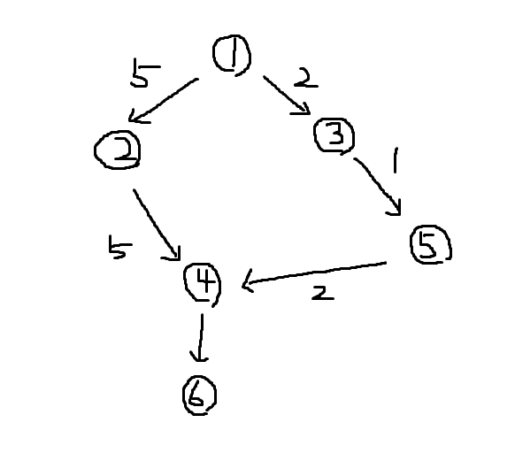

D[v] = D[u] + 1

+ 1이 아니라 간선의 가중치를 더한다

|      |  1   |  2   |  3   |  4   |  5   |  6   |
| :--: | :--: | :--: | :--: | :--: | :--: | :--: |
|  D   |  0   |  5   |  2   |  10  |  3   |  13  |

- 이 방법에선 4를 방문했었기 때문에 최단 경로를 찾을 수가 없다

- 다시 방문할지 말지를 D 값으로 판단해야 함
  - D값이 바뀔 때마다 Q에 넣어야 함


### 간선 완화(최단 경로 그림 참조)

- 다익스트라 알고리즘 찾아보기

- u, v 간선에 대한 완화 과정

- s에서 u를 거쳐서 v로 가는 방법 : D[u] + 가중치(u, v)

- s에서 v로 바로 가는 방법 : D[v]

```python
if D[v] > D[u] + 가중치(u, v):
    D[v] = D[u] + 가중치(u, v)
    Q.push(v)
```

|      | 1    | 2     | 3     | 4     | 5     | 6     | 7     | 8     |
| :--: | :--: | :--: | :--: | :--: | :--: | :--: | :--: | :--: |
|  D   | 0    | 큰 값 | 큰 값 | 큰 값 | 큰 값 | 큰 값 | 큰 값 | 큰 값 |
|  P   | 1 |       |       |       |       |       |       |       |

```python
# u에서 v로 갈 때
#1 1을 Q에 넣는다(while문 들어옴)
#2 Q에서 1를 pop, 1의 인접 정점을 찾는다
#3 Q에 1의 인접 정점인 2와 3을 넣는다
#4 간선의 값이 이전 값보다 작기 때문에 D2에 2를 넣는다
#5 2의 이전 정점이 1이기 때문에 P2에 1을 넣는다
#6 D3에 2를 넣고 P3에 1을 넣는다
#7 Q에 2의 인접 정점인 4와 5를 넣는다
# D [0, 2, 2, 5, 7]
# P [1, 1, 1, 2, 2]
# Q [1, 2, 3, 4, 5] 순서로 들어갔고, 1, 2가 빠져있는 상태 [3, 4, 5]
#8 Q에서 3을 pop, 3의 인접 정점을 찾고 Q에 인접 정점인 6을 넣는다
#9 Q에서 4를 pop, 4의 인접 정점을 찾고 Q에 인접 정점인 7을 넣는다
# D [0, 2, 2, 5, 7, 3, 9]
# P [1, 1, 1, 2, 2, 3, 4]
# Q [5, 6, 7]
#10 Q에서 5를 pop, 5의 인접 정점을 찾고 
```

```python
from queue import Queue

def BFS(s, G):
	# 시작점의 D를 0으로
    D[s] = 0
    Q = Queue()
    Q.put(s)

    while not Q.empty():
        # Q에서 하나를 꺼내 옴
        u = Q.get()
        # v는 인접 정점의 값, w는 가중치
        for v, w in G[u]:
            # D[v]와 D[u] + 가중치 비교
            if D[v] > D[u] + w:
                D[v] = D[u] + w
                P[v] = u
                Q.put(v)

    print()
# ----------------------------------------------

import sys
sys.stdin = open("weighted_graph.txt", "r")


V, E = map(int, input().split())
G = [[] for _ in range(V + 1)]
D = [0xfffff] * (V + 1)
P = [i for i in range(V + 1)]


for i in range(E):
    u, v, w = map(int, input().split())
    G[u].append((v, w))
    G[v].append((u, w))


BFS(1, G)

print(D[1:])
print(P[1:])
```


