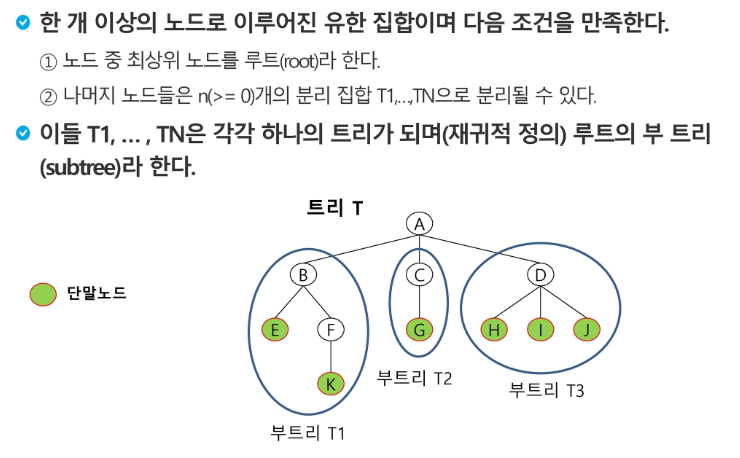

# 190305 트리

### 그래프의 하위 개념

**1:N 구조** : 부모(루트)는 하나, 자식은 여럿인 구조

**서브 트리(부트리)** : 큰 트리 아래에서 다시 분리되는 트리




**형제 노드** : 같은 부모를 가지는 노드

**조상 노드** : 해당 노드의 모든 부모 노드들

- 최소 공통 조상(Lowest Common Ancestor)

**자손 노드** : 해당 노드의 모든 자식 노드들

**차수(degree)** : 해당 노드에 연결된 자식 노드의 수(자손 아님)

**노드의 높이** : 루트에서 해당 노드까지의 간선 수, 노드의 레벨

**트리의 높이** : 트리에 있는 노드의 높이 중 가장 큰 값, 최대 노드 레벨

트리의 노드 수가 N개라면 간선 수는 N-1개

결합 컴포넌트(connected component)

트리는 싸이클이 없다!

- 그래프를 싸이클로 만들려면 간선을 끊어...?


### 이진 트리

- 모든 노드들이 2개의 서브 트리를 가지는 형태
- 각 노드가 가질 수 있는 자식의 수는 최대 2개(left/right child node)
- 모든 노드의 자식이 2개씩이면 높이 h인 노드의 최대 개수는 (2^h+1^-1)
- 모든 노드의 자식이 1개씩이면 높이 h인 노드의 최소 개수는 (h+1)


### 포화 이진 트리(Full Bianary Tree)

- 모든 레벨의 노드의 자식이 2개씩인 이진트리
- 루트를 1번으로 2^h+1^-1까지 정해진 위치에 대한 노드 번호를 가짐
  - 루트는 1, 루트의 자식 둘이 2, 3, 2의 자식 둘이 4, 5, 3의 자식 둘이 6, 7순
- 재귀적 구조라 어떤 노드를 보더라도 이진 트리(?)


### 완전 이진 트리(Complete)

- 높이가 h고 노드 수가 n개일 때(h+1 <= n < 2^h+1^-1) 포화 이진트리의 노드 번호가 1번부터 n번까지 빈 자리가 없는 이진 트리
- 높이가 3이면 2까지는 포화 이진트리여야 하고, 나머지는 자식 노드가 2개씩 빈 곳이 없이 차 있어야 함


### 편향 이진 트리(Skewed)

- 각 노드가 한쪽 방향의 자식 노드만을 가진 이진 트리


### 이진 트리 - 순회(traversal)

- 전위 순회(preorder traversal) : VLR
  - 부모 노드(V) 방문 후 자식 노드를 좌(L) 우(R) 순서로 방문
- 중위 순회(inorder traversal) : LVR
  - 왼쪽 자식 노드, 부모 노드, 오른쪽 자식 노드 순으로 방문
- 후위 순회(postorder traversal) : LRV
  - 자식 노드를 좌우 순서로 방문한 후, 부모 노드로 방문
- 어떤 방법이든 좌우의 순서는 좌가 항상 먼저, V를 언제 방문할지가 중요
  - 깊이 우선 탐색
- 어떤 방법이든 V - L - V - R 순서로 이동한다(이동하면서 작업을 언제 할지가 다름)
  - 모든 노드를 3번 지나간다.
    - 1) 처음 진입, L 방문 후 돌아올 때, R 방문 후 돌아올 때
    - 단말 노드는 하위에 가상의 노드가 있다고 생각(?)

**전위 순회** : [A] [BDEHI] [CFG] 순

**중위 순회** : [DBHEI] [A] [FCG] 순

**후위 순회** : [IHEDB] [FGC] [A] 순


### 이진 트리 - 배열

- 노드 번호의 성질
  - 노드 번호가 i인 노드의 부모 노드 번호 : i // 2
  - 노드 번호가 i인 노드의 왼쪽 자식 노드 번호 : 2 * i(오른쪽은 2 * i + 1)
  - 레벨 n의 노드의 시작 번호는 2^n^
- 높이가 h인 이진 트리를 위한 배열의 크기 : 2^h+1^-1


### 트리의 표현 - 연결리스트

- 배열로 이진 트리를 표현하면 메모리가 쓸 데 없이 커질 수 있는 단점을 보완하기 위해 연결 리스트를 이용해서 트리를 표현한다.


### 수식 트리

- 수식 이진 트리(Expression Binary Tree)라고 부르기도 함
- 연산자는 루트 노드이거나 가지 노드
- 피연산자는 모드 잎 노드(자식노드)


### 이진 탐색 트리

- 탐색 작업에 효율적

- 연속적인 배열이나 리스트 형태로 있음
- 모든 원소는 각자 유일한 키를 가짐
- 중위 순회를 하면 오름차순으로 정렬된 값을 얻을 수 있음
- `[2, 3, 5, 8, 10, 11, 14, 16]`이면 `8`이 루트, `3, 10`이 좌우 자식 노드


**이진 탐색 트리 삭제 연산**

- 자식이 없을 때 : 그냥 탐색으로 지우고, 부모의 왼쪽 자식을 가리키는 연결 리스트에 null을 입력
- 자식 1 : 자식을 지우고 자식의 자식을 연결
- 자식 2 : 규칙이 깨지지 않으려면 남아있는 노드 중 중간 값이 와야 한다(중간 값에 가장 가까운 값을 찾기 위해 왼쪽 서브 트리의 가장 큰 값이나 오른쪽 서브 트리의 가장 작은 값이 후보. 둘 중 중간 값에 가장 가까운 값


**이진 탐색 트리 성능**

- 탐색, 삽입, 삭제 시간은 트리의 높이 만큼 소요
- O(h) : h는 트리의 높이. h = logn
- 평균 : 이진 트리가 균형적으로 생성된 경우 => O(logn)
- 최악 : 한쪽으로 치우친 경사 이진 트리 => O(n) == 순차 탐색과 시간 복잡도가 같아짐


### 힙(heap)

- 우선 순위 큐(를 사용하는 대표적인 알고리즘 : 다익스트라, prim, 허프만)
- 완전 이진 트리의 노드 중 키 값이 가장 큰 노드나 가장 작은 노드를 찾기 위해 만든 자료 구조
- 동적인 자료(삽입, 삭제가 빈번하게 발생)를 처리하기 위해 사용
- 최대 힙(max heap)
  - {부모 노드의 키 값 > 자식 노드의 키 값} 비교
  - 루트 노드 : 키 값이 가장 큰 노드
- 최소 힙(min heap)
  - {부모 노드의 키 값 < 자식 노드의 키 값} 비교
  - 루트 노드 : 키 값이 가장 작은 노드

- 힙 연산에서 삭제는 루트를 삭제하는 것(최대값이나 최소값)

```python
#1 루트 노드 원소 삭제
#2 완전 이진 트리를 만들기 위해서 마지막 노드를 루트 위치로 이동
#3 루트로 올라간 노드와 그 자식을 비교해서 큰 값을 루트로
```


```python
class BinaryHeap(object):
    def __init__(self):
        self.arr = [0]
    
    def isEmpty(self):
        return len(self.arr) == 1
    
    def push(self, item):
        self.arr.append(item)
        
        c = len(self.arr) - 1
        p = int(c/2)
        while p > 0:
            if self.arr[c] < self.arr[p]:
                self.arr[c], self.arr[p] = self.arr[p], self.arr[c]
                c = p
                p = int(c/2)
            else:
                break
                
    def pop(self):
        ret = self.arr[1]
        self.arr[1] = self.arr[-1]
        self.arr.pop()
    	p, c = 1, 2
        last = len(self.arr) - 1
        while c <= last:
            if c + 1 <= last and self.arr[c] > self.arr[c + 1]:
                c += 1
            if self.arr[c] < self.arr[p]:
                self.arr[c], self.arr[p] = self.arr[p], self.arr[c]
                p = c
                c = p * 2
            else:
            	break
        
        return ret
```

