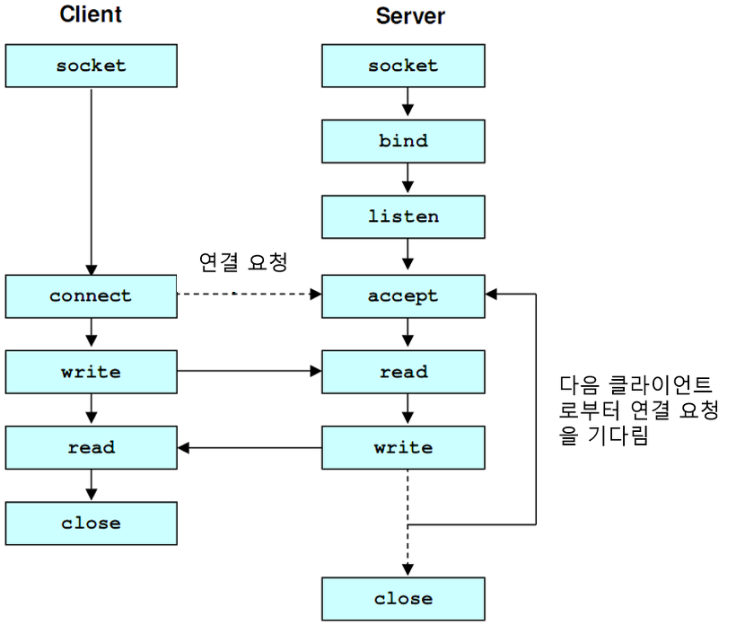

# Network

## TCP(Transmission Control Protocol)

**인터넷 상에서 데이터를 메시지의 형태로 보내기 위해 일반적으로 IP와 사용하는 프로토콜**

### TCP/IP

**IP**

- 데이터의 배달을 처리

**TCP**

- 패킷을 추적하고 관리
- 연결형 서비스

### TCP의 특징

- 연결형 서비스로 가상 회선 방식을 제공
  - 발신지와 수신지를 연결해 패킷을 전송하기 위한 논리적인 경로를 배정
- ==**3-way handshaking**== 과정을 통해 연결을 설정하고 ==**4-way handshaking**==을 통해 해제한다.
  - **3-way handshaking** : 목적지와 수신지를 확실히 하여 정확한 전송을 보장하기 위해 세션을 수립하는 과정
  - 연결 방식
    - 클라이언트가 서버에 접속을 요청하는 `SYN(a)` 패킷을 보낸다
    - 서버는 요청을 받고 요청을 수락한다는 `ACK(a+1)`와 `SYN(b)`이 설정된 패킷을 보낸다
    - 클라이언트는 `ACK(a+1)`와 `SYN(b)` 패킷을 받고 `ACK(b+1)`를 서버로 보내면 연결이 성립(**establish**)
  - 해제 방식
    - 클라이언트가 연결을 종료한다는 `FIN 플래그`를 전송한다
    - 서버는 요청을 받고 확인 메시지로 `ACK`를 보낸다(데이터 전송이 완료될 때까지 `TIME_OUT`)
    - 데이터 전송 완료 후 통신이 끝났으면 클라이언트에게 `FIN 플래그` 전송
    - 클라이언트는 `FIN 메시지`를 확인했다는 메시지 `ACK`를 보낸다
    - 클라이언트의 `ACK 메시지`를 받은 서버는 소켓 연결을 닫는다(**close**)
    - 클라이언트는 서버로부터 받지 못한 데이터가 있을 경우를 대비해 일정 시간 동안은 세션을 남겨두고 잉여 패킷을 기다린다(`TIME_WAIT`)
- 흐름 제어 및 혼잡 제어
- 높은 신뢰성을 보장한다
- UDP보다 속도가 느리다
- 전이중(Full-Duplex), 점대점(Point to Point) 방식
  - **전이중(Full-Duplex)**
    - 하나의 전송 선로에서 데이터가 동시에 양쪽 방향으로 전송될 수 있다.
    - 분리된 2개의 회선이 있는 TP 케이블을 사용하기 때문에 충돌이 발생하지 않는다.
  - 반이중(Half-Duplex)
    - 양방향으로 전송은 가능하지만 동시에 전송은 불가능함. 무전기 스타일
  - **점대점(Point to Point)**
    - 물리적으로는 중개 장치를 통과하지 않고 한 지점에서 다른 지점으로 직접 가는 채널
    - 논리적으로는 두 장비 간의 통신
    - 한 개의 터미널이 하나의 회선만으로 컴퓨터에 연결되기 때문에 비경제적
    - 한 개의 터미널은 통신 제어 장치 내에 있는 하나의 접속 포트와 두 개의 모뎀을 필요로 한다.
    - 컴퓨터와 터미널이 계속 대화하면서 빠른 응답이 필요한 경우, 컴퓨터 시스템이 다른 대형 컴퓨터에 연결되어 터미널처럼 사용되는 경우에 주로 이용
    - 두 스테이션을 별도의 회선을 사용해 1:1로 연결
    - 전용 회선이나 공중 전화 회선을 이용
    - 회선 구성이 간단하고 대용량 전송에 유리
    - 별도의 회선과 포트에 따른 높은 설치 비용
  - 다중점(Multipoint)
    - 하나의 공유된 전송 회선에 여러 스테이션을 접속하는 방식, 서로 통신하고자 하는 스테이션들을 어떻게 연결하는지는 회선 구성의 문제, `토폴로지`라고 부르기도 함
    - 위상 : 한 링크에 접속된 스테이션들의 물리적인 배열
    - 중앙 컴퓨터와 단말기의 효과적인 연결에 널리 사용
    - 멀티 드롭(Multidrop) 방식이라고도 함
    - 송수신하는 데이터의 양이 적을 때 효율적
    - 구성 비용은 줄일 수 있으나 논리가 복잡
- TCP는 연결형 서비스로 신뢰성을 보장하기 때문에 `3-way handshaking` 과정이 있고, 데이터의 흐름제어나 혼잡 제어와 같은 기능을 함
- 하지만 그렇기 때문에 UDP보다 속도가 느림(CPU를 사용해서 속도에 영향)
- ==연속성보다 신뢰성 있는 전송이 중요할 때 사용==

### TCP 서버의 특징

- 서버 소켓은 연결만을 담당
- 연결 과정에서 반환된 클라이언트 소켓은 데이터 송수신에 사용된 다형 서비스로 가상 회선 방식을 제공
- 서버와 클라이언트는 1:1로 연결
- 스트림 전송이기 때문에 전송 데이터의 크기가 무제한
- 패킷의 응답을 해야 하기 때문에 성능이 낮다.(시간 지연, CPU 소모)
- 손실된 패킷이 있으면 재전송 요청을 해서 Streaming 서비스에 불리하다.

- 패킷에 번호를 부여해 분실 확인 등의 처리를 하거나 목적지에서 재조립을 한다.

## UDP(User Datagram Protocol)

**데이터를 데이터그램 단위로 처리하는 프로토콜**

**데이터그램**

- 독립적인 관계를 지니는 패킷

**UDP**

- 연결을 위해 할당되는 논리적인 경로가 없기 때문에 각 패킷이 다른 경로로 전송
- 각 패킷은 독립적인 관계를 가지고, 다른 경로로 독립적으로 처리됨

### UDP의 특징

- 비연결형 서비스로 데이터그램 방식을 제공
- 정보를 주고 받을 때 정보를 보내거나 받는다는 신호 절차가 없음
- UDP 헤더의 CheckSum 필드를 통해 최소한의 오류만 검출
- 그래서 신뢰성이 낮고, TCP보다 속도가 빠르다.
- 연결을 설정하고 해제하는 과정이 없다.
- 패킷의 순서를 부여하거나 재조립 해 흐름 제어나 혼잡 제어를 하지 않아 TCP보다 빠르고 네트워크 부하가 적다
- 하지만 신뢰성은 부족해 ==신뢰성보다는 연속성이 중요한 서비스== (실시간 스트리밍)에 사주 사용

### UDP 서버의 특징

- UDP는 연결을 하지 않기 때문에 connect 함수가 필요 없고, 서버와 클라이언트 소켓의 구분이 없다.
- 소켓 대신 IP를 기반으로 데이터를 전송한다.
- 서버와 클라이언트는 `1:1`, `1:N`, `N:M` 등으로 연결이 가능하다.
- 데이터그램(메시지) 단위로 전송되며, 크기는 65535바이트가 넘으면 잘라서 보낸다.
- 흐름 제어(Flow Control)가 필요 없어서 패킷이 제대로 전송됐는지나 오류 여부를 확인할 수 없다
  - 흐름 제어(Flow Control)
    - 데이터를 송신하는 곳과 수신하는 곳의 데이터 처리 속도를 조절해서 수신자의 버퍼 오버플로우를 방지하는 것
    - 송신하는 쪽에서 많은 데이터를 너무 빠르게 보내면 수신자에게 문제가 발생하기 때문
  - 혼잡 제어(Congestion Control)
    - 네트워크 내의 패킷 수가 넘치게 증가하지 않도록 방지하는 것
    - 정보 소통량이 과다하면 패킷을 조금만 전송해서 혼잡 붕괴 현상을 방지
- 파일 전송처럼 신뢰성이 필요한 서비스보다 성능이 중요시 되는 경우 사용

| 프로토콜 종류  |      TCP       |           UDP            |
| :------------: | :------------: | :----------------------: |
|   연결 방식    | 연결형 서비스  |     비연결형 서비스      |
| 패킷 교환 방식 | 가상 회선 방식 |     데이터그램 방식      |
|   전송 순서    | 전송 순서 보장 | 전송 순서가 바뀔 수 있음 |
| 수신 여부 확인 | 수신 여부 확인 | 수신 여부 확인하지 않음  |
|   통신 방식    |    1:1 통신    |    1:1, 1:N, N:N 통신    |
|     신뢰성     |      높다      |           낮다           |
|      속도      |     느리다     |          빠르다          |

### TCP Flow

### UDP Flow

## HTTP/HTTPS

### HTTP의 문제점

- HTTP는 평문 통신이기 때문에 도청이 가능하다.
- 통신 상대를 확인하지 않기 때문에 위장이 가능하다.
- 완전성을 증명할 수 없기 때문에 변조가 가능하다.

#### TCP/IP는 도청 가능한 네트워크

- TCP/IP 구조의 통신은 전부 통신 경로 상에서 엿볼 수 있다. 패킷을 수집하는 것만으로 도청할 수 있다. 평문으로 통신을 할 경우 메시지의 의미를 파악할 수 있기 때문에 암호화하여 통신해야 한다.

- **보완 방법**
  - 통신 자체를 암호화
    - `SSL(Secure Socket Layer)`나 `TLS(Transport Laye Security)`라는 다른 프로토콜을 조합함으로서 HTTP의 통신 내용을 암호화할 수 있다. SSL을 조합한 HTTP를 `HTTPS(HTTP Secure)`나 `HTTP over SSL`이라고 부른다
  - 콘텐츠를 암호화
    - HTTP 메시지에 포함되는 콘텐츠를 암호화하는 것, 받는 측에서 해독해야 한다.

#### 통신 상대를 확인하지 않기 때문에 위장이 가능하다.

- HTTP 통신은 상대가 누구인지 확인하는 처리가 없기 때문에 누구든 요청을 보낼 수 있다. IP주소나 포트 등에서 그 웹 서버의 엑세스 제한이 없는 경우엔 요청이 오면 상대가 누구든 응답을 한다.
- 문제점
  - 요청을 보낸 곳의 웹 서버가 의도한 응답을 보내야 하는 웹 서버인지 확인할 수 없다.
  - 응답을 반환한 곳의 클라이언트가 원래 의도한 요청을 보낸 클라이언트인지 확인할 수 없다.
  - 통신하고 있는 상대가 접근이 허가된 상대인지 확인할 수 없다.
  - 어디에서 누가 요청했는지 확인할 수 없다.
  - 의미 없는 요청도 수신한다. => DoS 공격(서비스 거부 공격)을 방지할 수 없다.

- **보완 방법**
  - SSL은 상대를 확인하는 수단으로 `증명서	`를 제공하고 있다.
  - 증명서는 **신뢰할 수 있는 제3자 기관에 의해 발행**되어 서버나 클라이언트가 실재한다는 사실을 증명한다.
  - 개인정보 누설 등의 위험성이 줄어든다.

####  완전성을 증명할 수 없기 때문에 변조가 가능하다

- 완전성 : 정보의 정확성
  - 서버나 클라이언트에서 수신한 내용과 송신한 낸용이 일치한다는 보장이 없다.
  - 요청이나 응답이 보내지고 수신하기 전에 누군가에 의해 변조되어도 알 수 없다.
  - 이것을 중간자 공격(Man in the Middle)이라고 부른다.
- **보완 방법**
  - `MDS`, `SHA-1` 등의 해시 값을 확인하거나 파일의 디지털 서명을 확인 : 확실하진 않다
  - `HTTPS`의 `SSL`은 인증, 암호화, 그리고 다이제스트 기능을 제공한다.

### HTTPS

- HTTP에 암호화와 인증, 완전성 정보를 더한 HTTPS

- 새로운 애플리케이션 계층의 프로토콜이 아니라 HTTP의 통신 소켓을 `SSL(Secure Socket Layer)`나 `TLS(Transport Layer Security)`라는 프로토콜로 대체하는 것

- HTTP는 TCP와 직접 통신했지만 HTTPS에서 HTTP는 SSL, SSL이 TCP와 통신한다.
- HTTPS의 SSL에서는 공통키 암호화 방식과 공개키 암호화 방식을 혼합한 하이브리드 암호 시스템을 사용한다.
  - 공통키를 공개키 암호화 방식으로 교환한 다음, 이후의 통신은 공통키 암호를 사용하는 방식
- 암호화 통신인 대신 CPU와 메모리 등의 리소스가 많이 필요하다. 통신 때마다 암호화를 하면 서버 한 대당 처리할 수 있는 요청의 수가 줄어들기 때문에 민감한 정보를 다룰 때만 HTTPS를 사용

## DNS Round Robin 방식

### DNS Round Robin 방식의 문제점

- 서버의 수만큼 공인 IP 주소가 필요함
  - 부하 분산을 위해 서버 대수를 늘리기 위해서는 그만큼의 공인 IP가 필요하다.
- 균등하게 분산되지 않음
  - 스마트폰의 접속은 `캐리어 게이트웨이`라는 `프록시 서버`를 경유한다.
  - 프록시 서버는 이름 변환 결과가 일정 시간 동안 캐싱되므로 같은 프록시를 경유하는 접속은 항상 같은 서버로 접속된다.
  - PC용 웹 브라우저도 DNS 질의 결과를 캐싱하기 때문에 균등하게 부하 분산되지 않는다.
  - DNS 레코드의 TTL 값을 짧게 설정함으로써 어느 정도 해소가 되지만, TTL에 따라 캐시를 해제하는 것이 아니기 떄문에 주의해야 한다.
- 서버가 다운돼도 확인 불가
  - DNS 서버는 웹 서버의 부하나 접속 수 등의 상황에 따라 질의 결과를 제어할 수 없다.
  - 웹 서버의 부하가 높아서 응답이 느려지거나 접속 수가 꽉 차서 접속을 처리할 수 없는 상황인지를 전혀 감지할 수 없어 어떤 원인으로 다운되어도 검출하지 못하고 사용자에게 제공한다.
  - 위의 결과로 사용자는 다운된 서버로 연결이 될 수도 있다.
  - DNS Round Robin은 부하 분산을 위한 것이고 다중화는 아니기 때문에 다른 소프트웨어와의 조합이 필요하다.

#### weighted round robin

- 각 웹 서버에 가중치를 가미해서 분산 비율을 변경한다. 가중치가 큰 서버일수록 빈번하게 선택되기 때문에 처리 능력이 높은 서버를 높게 설정하는 게 좋다.

#### least-connection

- 접속 클라이언트 수가 가장 적은 서버를 선택한다. 로드밸런서에서 실시간으로 connection 수를 관리하거나 각 서버에서 주기적으로 알려주는 것이 필요하다.

## 웹 통신 흐름

**Chrome 주소창에 URL을 입력했을 때**

### 브라우저

- URL에 입력된 값을 브라우저 내부에서 결정된 규칙에 따라 의미를 조사한다.
- 조사된 의미에 따라 HTTP Request 메시지를 만든다.
- 만들어진 메시지를 웹 서버로 전송한다.
  - 메시지 전송은 브라우저에 없는 기능이기 때문에 직접 하지 않고 OS에 넘긴다.
  - OS에 송신을 넘길 때, 도메인명이 아니라 IP 주소로 상대를 지정해야 하기 때문에 DNS 서버를 조회해야 한다.

### 프로토콜 스택, LAN 어댑터

- 프로토콜 스택(운영체제에 내장된 네트워크 제어용 소프트웨어)이 브라우저로부터 메시지를 받는다.
- 브라우저로부터 받은 메시지를 패킷 속에 저장한다.
- 수신처 주소 등의 제어 정보를 덧붙인다.
- 패킷을 LAN 어뎁터에 넘긴다.
- LAN 어댑터는 패킷을 전기 신호로 변환시킨다.
- 신호를 LAN 케이블에 송출시킨다.
  - 프로토콜 스택은 통신 중 오류가 발생했을 때, 제어 정보를 사용해 고쳐 보내거나 상황을 조절하는 등의 역할을 맡는다.

### 허브, 스위치, 라우터

- LAN 어댑터가 송신한 패킷은 스위칭 허브를 경유해 인터넷 접송용 라우터에 도착한다.
- 라우터는 패킷을 프로바이더(통신사)에게 전달한다.
- 인터넷으로 들어간다.

### 액세스 회선, 프로바이더

- 패킷은 인터넷 입구의 액세스 회선(통신 회선)에 의해 POP(Point Of Presence, 통신사용 라우터)까지 운반된다.
- POP를 거쳐 인터넷의 핵심부로 들어가게 된다.
- 수 많은 고속 라우터들 사이로 패킷이 목적지를 향해 흘러가게 된다.

### 방화벽, 캐시서버

- 패킷은 인터넷 핵심부를 통과하여 웹 서버측의 LAN에 도착
- 박화벽이 패킷을 검사
- 패킷이 웹 서버까지 가야 하는지 아닌지를 판단하는 캐시 서버가 존재
  - 액세스한 페이지의 데이터가 캐시 서버에 있으면 웹 서버에 요청하지 않고 값을 읽을 수 있다. 페이지 데이터 중 다시 이용할 수 있는 것이 있으면 캐시 서버에 저장된다.

### 웹 서버

- 패킷이 물리적인 웹 서버에 도착하면 웹 서버의 프로토콜 스택은 패킷을 추출하여 메시지를 복원하고 웹 서버 애플리케이션에 넘긴다.
- 메시지를 받은 웹 서버 애플리케이션은 응답 메시지에 넣어 클라이언트로 보낸다.
- 온대로 클라이언트에 전달

OSI 7계층, 게이트웨이

